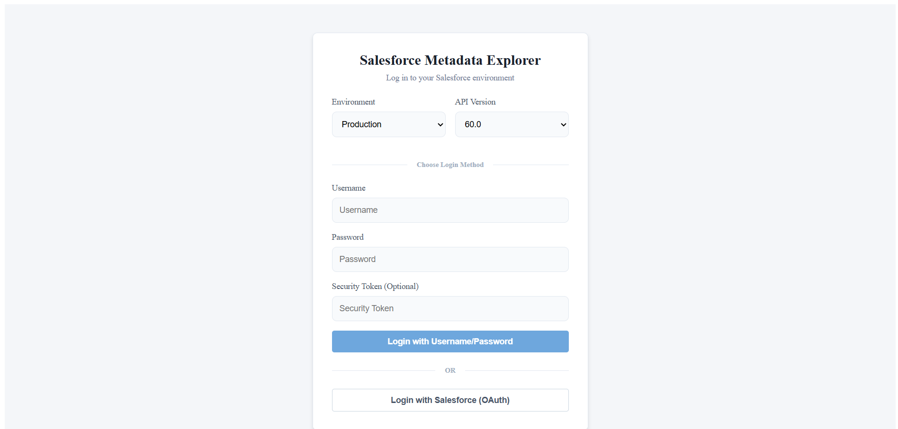
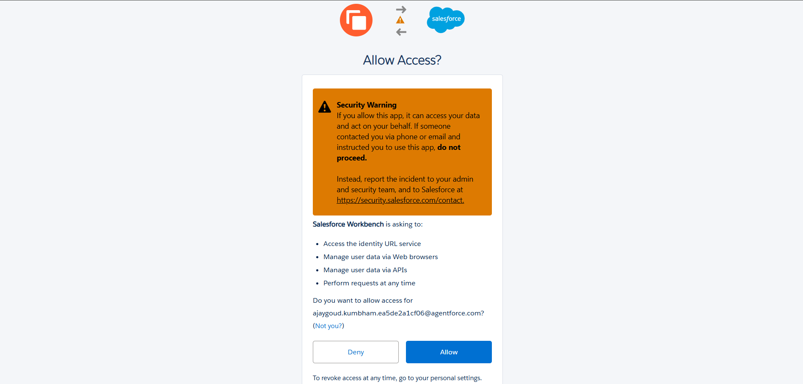
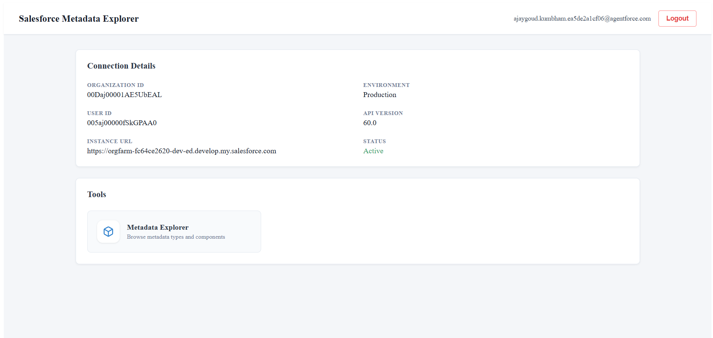
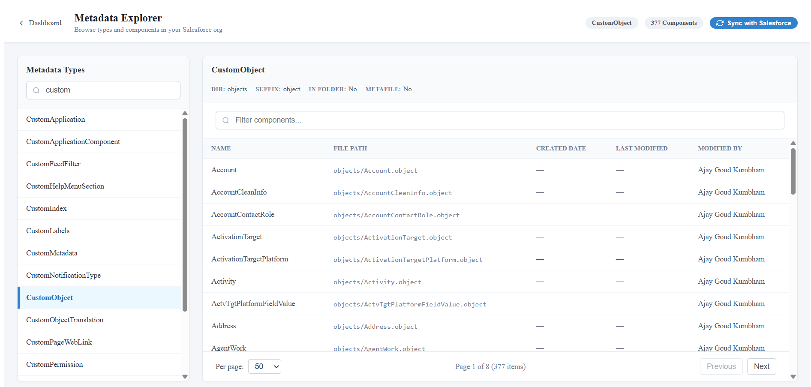

<h1 align="center">Salesforce Metadata Explorer</h1>

<p align="center">
  A full-stack application for browsing Salesforce metadata in Production or Sandbox orgs.
</p>



Salesforce Metadata Explorer connects to your org through a secure backend, stores session data server-side (the browser only receives a connection identifier), and encrypts sensitive values at rest with AES-256. After sign-in, you review live connection details on a dashboard and browse metadata types and components with search, pagination, and on-demand sync from Salesforce.

## Features

**Dual authentication** — sign in with username and password (Partner SOAP API) or OAuth 2.0 with PKCE; choose Production or Sandbox and the API version before connecting.

**OAuth consent** — when using Salesforce login, approve access for your External Client App (Connected App); the backend completes the token exchange and redirects you back to the app.



**Connection dashboard** — view organization ID, user ID, instance URL, environment, API version, and session status, then open tools such as Metadata Explorer from one place.



**Metadata Explorer** — select a metadata type, filter components, inspect file paths and audit fields, paginate large result sets, and sync cached data from Salesforce on demand.



## Built With

- [Angular 19](https://angular.dev/) and TypeScript for the frontend
- [Spring Boot 3.2](https://spring.io/projects/spring-boot) and Java 17 for the HTTP API
- [PostgreSQL](https://www.postgresql.org/) with Spring Data JPA / Hibernate for persistence and metadata caching
- [Salesforce WSC](https://github.com/forcedotcom/wsc) (force-wsc) with Partner and Metadata APIs
- OAuth 2.0 with PKCE for web login; AES-256 encryption for tokens and credentials at rest

## Project Structure

```text
.
├── assets/                                    # README screenshots
├── salesforce-workbench-backend/              # Spring Boot API and Salesforce integration
│   ├── src/main/java/com/salesforce/workbench/
│   │   ├── auth/                              # OAuth and username/password authenticators
│   │   ├── config/                            # CORS, Salesforce properties
│   │   ├── controller/                        # Auth and metadata REST endpoints
│   │   ├── service/                           # Connections, metadata sync, caching
│   │   └── entity/                            # JPA models (connections, metadata cache)
│   └── src/main/resources/
│       ├── application.yml
│       └── application-local.yml.example      # Copy to application-local.yml (not committed)
└── salesforce-workbench-frontend/             # Angular SPA
    ├── src/app/features/                      # Login, dashboard, metadata explorer, OAuth callback
    ├── src/app/core/                          # Auth and metadata services, HTTP interceptor
    └── proxy.conf.json                        # Proxies /api to localhost:8080 in dev
```

## Getting Started

### Prerequisites

- **Java 17** or later
- **Maven 3.8** or later
- **Node.js 18+** and **npm** (LTS recommended)
- **PostgreSQL** (local or reachable instance)
- A **Salesforce org** with permission to create Connected Apps (required for OAuth)

OAuth login requires a Salesforce **External Client App** (Connected App). Username/password login does not use the client secret but still requires a user allowed to authenticate via the API.

---

### Step 1: Create a PostgreSQL database

```sql
CREATE DATABASE workbench;
```

Defaults in this project assume `localhost:5432`, database `workbench`, user `postgres`.

### Step 2: Create a Salesforce External Client App (Connected App)

Create the app in the same org type you plan to use first (Production vs Sandbox).

1. Sign in to Salesforce and open **Setup**.
2. In Quick Find, search for **App Manager** and open it.
3. Click **New Connected App** (or **New External Client App**, depending on your org UI).
4. Fill in basic information:
   - **Connected App Name**: e.g. `Salesforce Metadata Explorer Local`
   - **API Name**: auto-filled is fine
   - **Contact Email**: your email
5. Enable OAuth:
   - Check **Enable OAuth Settings**
   - **Callback URL** (must match exactly):

     ```
     http://localhost:8080/api/auth/oauth/callback
     ```

   - **Selected OAuth Scopes** — add at least:
     - Access and manage your data (api)
     - Full access (full)
     - Perform requests on your behalf at any time (refresh_token, offline_access)
     - Web- or identity-related scopes your org offers if listed separately

     The backend requests: `refresh_token`, `offline_access`, `api`, and `web`.

6. Save the app. If Salesforce warns that the app may take time to activate, wait several minutes (often up to 10) before testing OAuth.

7. On the app detail page, copy:
   - **Consumer Key** → `salesforce.auth.oauth.client-id`
   - **Consumer Secret** → `salesforce.auth.oauth.client-secret`

8. **PKCE**: The app uses PKCE (`code_challenge_method=S256`). Enable authorization code flow with PKCE on the Connected App if your org exposes that option.

9. **Sandbox vs Production**: Production uses `https://login.salesforce.com`; Sandbox uses `https://test.salesforce.com`. The environment on the login page must match where the Connected App was created.

#### Username/password login (optional)

- Use a Salesforce user permitted to log in via API.
- If your org requires it, enter your **security token** in the Security Token field (the backend applies it when provided).
- Reset a token from **Settings → My Personal Information → Reset My Security Token** (wording may vary in Lightning).

### Step 3: Configure and run the backend

```bash
cd salesforce-workbench-backend
cp src/main/resources/application-local.yml.example src/main/resources/application-local.yml
```

On Windows (PowerShell):

```powershell
Copy-Item src/main/resources/application-local.yml.example src/main/resources/application-local.yml
```

Edit `src/main/resources/application-local.yml`:

| Property | Description |
|----------|-------------|
| `spring.datasource.url` | JDBC URL, default `jdbc:postgresql://localhost:5432/workbench` |
| `spring.datasource.username` | PostgreSQL user |
| `spring.datasource.password` | PostgreSQL password |
| `salesforce.auth.encryption-key` | **Exactly 32 characters** — AES-256 key for secrets at rest |
| `salesforce.auth.oauth.client-id` | Connected App Consumer Key |
| `salesforce.auth.oauth.client-secret` | Connected App Consumer Secret |

Do not commit `application-local.yml`.

Optional overrides in `application.yml` (defaults shown):

- `salesforce.auth.oauth.redirect-uri`: `http://localhost:8080/api/auth/oauth/callback`
- `salesforce.auth.frontend-url`: `http://localhost:4200`

Start the API:

```bash
mvn spring-boot:run
```

The server listens on [http://localhost:8080](http://localhost:8080). Hibernate `ddl-auto: update` creates or updates tables on first run.

### Step 4: Configure and run the frontend

In a second terminal:

```bash
cd salesforce-workbench-frontend
npm install
npm start
```

Open [http://localhost:4200](http://localhost:4200). Requests to `/api/*` are proxied to port `8080` via `proxy.conf.json`; keep the backend running while using the UI.

### Step 5: Sign in and verify

1. Select **Environment** and **API Version** on the login page.
2. Use **Login with Username/Password** or **Login with Salesforce (OAuth)** and click **Allow** on the Salesforce consent screen when prompted.
3. Confirm the dashboard shows **Active** status and correct org metadata.
4. Open **Metadata Explorer**, choose a type (e.g. CustomObject), and click **Sync with Salesforce**.

---

### Available commands

| Command | Purpose |
|---------|---------|
| `mvn spring-boot:run` (in `salesforce-workbench-backend`) | Starts the Spring Boot API on port `8080`. |
| `npm install` (in `salesforce-workbench-frontend`) | Installs frontend dependencies. |
| `npm start` (in `salesforce-workbench-frontend`) | Starts the Angular dev server on port `4200` with API proxy. |

### Local runtime flow

```text
Browser (localhost:4200)
    → Angular dev server
    → /api/* proxied to Spring Boot (localhost:8080)
    → PostgreSQL (workbench)
    → Salesforce APIs (OAuth / SOAP / Metadata)
```

OAuth: browser → Salesforce authorize → `http://localhost:8080/api/auth/oauth/callback` → backend token exchange → redirect to frontend with session.

## Troubleshooting

| Issue | What to check |
|-------|----------------|
| OAuth `redirect_uri` mismatch | Connected App callback must exactly match `http://localhost:8080/api/auth/oauth/callback` |
| Invalid client id / secret | Consumer Key and Secret from the correct org; wait after creating a new Connected App |
| Wrong org on OAuth | Login environment must match Production vs Sandbox where the app exists |
| Database connection failed | PostgreSQL running, database `workbench` created, credentials in `application-local.yml` |
| Encryption errors on login | `encryption-key` must be exactly 32 characters |
| API calls fail from UI | Backend on port `8080`; frontend started with `npm start` (proxy enabled) |
| Username/password rejected | API login enabled for user, correct security token, correct environment |

## Further documentation

- `salesforce-workbench-backend/README.md` — API endpoints and backend architecture
- `salesforce-workbench-frontend/README.md` — frontend structure and commands

## License

Use and modify this project according to your organization's policies and Salesforce API terms of use.
